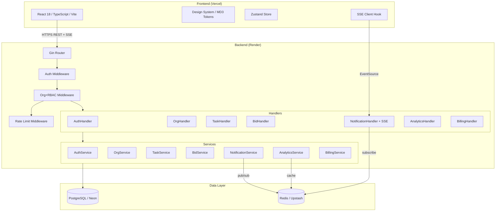
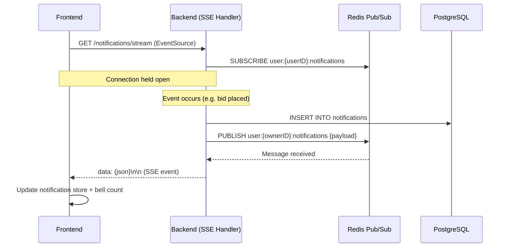

# Design Document: SaaS Platform Transformation

## Overview

This document describes the technical design for transforming the existing task delegation platform into a multi-tenant B2B SaaS product. The existing platform has a working Go/Gin backend with PostgreSQL and Redis, and a React/TypeScript frontend. The transformation adds organizations, RBAC, billing tiers, real-time notifications, a modern design system, and advanced task workflow features — all while preserving and extending the existing codebase.

The core architectural shift is from a single-tenant, flat-user model to a multi-tenant model where every resource (task, bid, analytics) is scoped to an Organization. Every authenticated request carries both a user identity and an organization+role context.

### Key Design Decisions

- **SSE over WebSockets** for real-time notifications: simpler to implement on Render (no sticky sessions needed), sufficient for one-directional server-push events.
- **Additive migrations** for the database: existing tables are extended with `org_id` foreign keys rather than replaced, preserving data.
- **Middleware-enforced RBAC**: a single `OrgMiddleware` resolves org+role from JWT claims and attaches to Gin context; downstream handlers check role via helper functions.
- **Redis for SSE fan-out**: when a notification is created, it is published to a Redis pub/sub channel keyed by `user:{id}:notifications`; SSE handlers subscribe and forward to the HTTP stream.
- **Design tokens via CSS custom properties**: Material Design 3 tokens are defined as CSS variables in a single `tokens.css` file, consumed by Tailwind config and component styles.


---

## Architecture

### System Architecture Diagram



### Request Lifecycle

1. Frontend sends request with `Authorization: Bearer <access_token>`.
2. `AuthMiddleware` validates JWT, extracts `user_id` and `org_id` from claims.
3. `OrgMiddleware` loads the membership record from DB (or Redis cache), attaches `org_id`, `role`, and `subscription_tier` to Gin context.
4. `RateLimitMiddleware` checks Redis counters for the endpoint+IP combination.
5. Handler calls service; service enforces business rules using the context values.
6. Response is returned; if a notification-triggering event occurred, `NotificationService.Publish` writes to DB and publishes to Redis pub/sub.


---

## Components and Interfaces

### Backend Services

#### AuthService (extended)
Extends the existing service with org-aware token generation and role invalidation.

```go
type AuthService interface {
    Register(ctx, req) (*AuthResponse, error)
    Login(ctx, req) (*AuthResponse, error)
    RefreshToken(ctx, refreshToken string) (*AuthResponse, error)
    Logout(ctx, userID string) error                          // invalidates refresh token in Redis
    UpdateProfile(ctx, userID string, req UpdateProfileRequest) (*User, error)
    ChangePassword(ctx, userID string, req ChangePasswordRequest) error
    InvalidateUserTokens(ctx, userID string) error           // called on role change
}
```

#### OrgService (new)
```go
type OrgService interface {
    CreateOrg(ctx, ownerID string, req CreateOrgRequest) (*Organization, error)
    GetOrg(ctx, orgID string) (*Organization, error)
    UpdateOrg(ctx, orgID string, req UpdateOrgRequest) (*Organization, error)
    GetMembership(ctx, userID, orgID string) (*Membership, error)
    InviteMember(ctx, orgID, inviterID string, req InviteRequest) (*Invitation, error)
    AcceptInvitation(ctx, token string, newUser RegisterRequest) (*AuthResponse, error)
    RevokeInvitation(ctx, orgID, invitationID string) error
    ListInvitations(ctx, orgID string) ([]*Invitation, error)
    RemoveMember(ctx, orgID, memberID string) error
    ChangeRole(ctx, orgID, memberID string, newRole Role) error
    CompleteOnboarding(ctx, orgID string, step int) error
    GetAuditLog(ctx, orgID string, page, pageSize int) ([]*AuditEntry, error)
}
```

#### BillingService (new)
```go
type BillingService interface {
    GetSubscription(ctx, orgID string) (*Subscription, error)
    UpdateTier(ctx, orgID string, tier SubscriptionTier) error
    CheckMemberLimit(ctx, orgID string) error   // returns error if at limit
    CheckTaskLimit(ctx, orgID string) error     // returns error if at limit
}
```

#### NotificationService (new)
```go
type NotificationService interface {
    Publish(ctx, userID string, event NotificationEvent) error
    GetHistory(ctx, userID string, page, pageSize int) ([]*Notification, error)
    MarkRead(ctx, userID, notifID string) error
    MarkAllRead(ctx, userID string) error
    Subscribe(ctx, userID string) (<-chan NotificationEvent, func(), error) // returns channel + unsubscribe fn
}
```

#### TaskService (extended)
```go
// Extended with org scoping, activity feed, comments, checklist, search
type TaskService interface {
    CreateTask(ctx, orgID, ownerID string, req CreateTaskRequest) (*Task, error)
    GetTask(ctx, orgID, taskID string) (*TaskDetail, error)  // includes activity + comments
    SearchTasks(ctx, orgID string, params SearchParams) (*PagedResult[Task], error)
    UpdateTask(ctx, orgID, taskID, actorID string, req UpdateTaskRequest) (*Task, error)
    DeleteTask(ctx, orgID, taskID, actorID string) error
    TransitionStatus(ctx, orgID, taskID, actorID string, newStatus TaskStatus) error
    AddComment(ctx, orgID, taskID, authorID string, text string) (*Comment, error)
    UpdateChecklist(ctx, orgID, taskID string, items []ChecklistItem) error
}
```

#### AnalyticsService (extended)
```go
type AnalyticsService interface {
    GetOrgDashboard(ctx, orgID string) (*OrgDashboard, error)
    GetMemberReport(ctx, orgID, memberID string) (*MemberReport, error)
    GetTrends(ctx, orgID string, days int) (*TrendData, error)   // pro/enterprise only
    ExportCSV(ctx, orgID string) ([]byte, error)                 // enterprise only
}
```

### Frontend Architecture

New pages and components added on top of the existing structure:

```
frontend/src/
├── design-system/
│   ├── tokens.css          # CSS custom properties (MD3 color, spacing, type, elevation)
│   ├── components/
│   │   ├── Button.tsx       # primary | secondary | ghost | danger
│   │   ├── Card.tsx         # elevation level prop
│   │   ├── Badge.tsx        # status | priority variants
│   │   ├── Input.tsx        # label + helper + error state
│   │   ├── Modal.tsx        # desktop modal / mobile bottom sheet
│   │   ├── Toast.tsx        # toast notification + swipe-to-dismiss
│   │   ├── Avatar.tsx
│   │   ├── Skeleton.tsx
│   │   └── EmptyState.tsx
│   └── index.ts
├── components/
│   ├── common/
│   │   ├── Layout.tsx       # redesigned with sidebar + bottom nav
│   │   ├── Sidebar.tsx      # collapsible desktop sidebar
│   │   ├── BottomNav.tsx    # mobile bottom navigation
│   │   └── NotificationBell.tsx
│   ├── tasks/               # existing + extended
│   ├── bids/                # existing
│   └── onboarding/
│       └── OnboardingWizard.tsx
├── pages/
│   ├── Login.tsx            # redesigned
│   ├── Register.tsx         # redesigned + org create/join choice
│   ├── Dashboard.tsx        # redesigned
│   ├── MyTasks.tsx          # redesigned
│   ├── MyBids.tsx           # redesigned
│   ├── Analytics.tsx        # org-scoped
│   ├── MyAnalytics.tsx
│   ├── TaskDetail.tsx       # new: activity feed + comments
│   ├── OrgSettings.tsx      # new: members, billing, invitations
│   ├── Profile.tsx          # new: profile + notification prefs
│   └── Notifications.tsx    # new: notification history
├── hooks/
│   ├── useSSE.ts            # SSE connection management
│   ├── useNotifications.ts
│   └── useRBAC.ts           # role-based UI helpers
├── store/
│   ├── authStore.ts         # extended with org + role
│   └── notificationStore.ts # new
└── services/
    ├── orgService.ts        # new
    ├── billingService.ts    # new
    ├── notificationService.ts # new
    └── ...existing
```


### API Endpoint Design

All new endpoints are under `/api/v1` and require `Authorization: Bearer <token>` unless marked public.

#### Auth (extended)
| Method | Path | Description |
|--------|------|-------------|
| POST | `/auth/register` | Register + org create/join choice |
| POST | `/auth/login` | Login (returns org_id + role in token) |
| POST | `/auth/refresh` | Refresh access token |
| POST | `/auth/logout` | Invalidate refresh token |
| GET | `/users/me` | Get current user + membership |
| PUT | `/users/me` | Update profile (name, avatar, skills) |
| PUT | `/users/me/password` | Change password |
| PUT | `/users/me/notifications` | Update notification preferences |

#### Organizations
| Method | Path | Description |
|--------|------|-------------|
| POST | `/orgs` | Create organization (public, called after register) |
| GET | `/orgs/me` | Get current user's organization |
| PUT | `/orgs/me` | Update org profile (org_admin only) |
| GET | `/orgs/me/members` | List members (manager+) |
| DELETE | `/orgs/me/members/:memberID` | Remove member (org_admin) |
| PATCH | `/orgs/me/members/:memberID/role` | Change member role (org_admin) |
| POST | `/orgs/me/invitations` | Send invitation (org_admin, manager) |
| GET | `/orgs/me/invitations` | List invitations (org_admin) |
| DELETE | `/orgs/me/invitations/:id` | Revoke invitation (org_admin) |
| POST | `/orgs/join` | Accept invitation (public, with token) |
| GET | `/orgs/me/audit-log` | Paginated audit log (enterprise, org_admin) |
| PATCH | `/orgs/me/onboarding` | Update onboarding step |

#### Billing
| Method | Path | Description |
|--------|------|-------------|
| GET | `/billing/subscription` | Get current subscription |
| PUT | `/billing/subscription` | Change tier (org_admin) |

#### Tasks (extended)
| Method | Path | Description |
|--------|------|-------------|
| POST | `/tasks` | Create task (manager+) |
| GET | `/tasks` | Search/filter/paginate tasks (org-scoped) |
| GET | `/tasks/:id` | Get task detail with activity + comments |
| PUT | `/tasks/:id` | Update task |
| DELETE | `/tasks/:id` | Delete task |
| PATCH | `/tasks/:id/status` | Transition status |
| POST | `/tasks/:id/comments` | Add comment |
| PUT | `/tasks/:id/checklist` | Update checklist |
| POST | `/tasks/:id/bids` | Place bid (employee) |
| GET | `/tasks/:id/bids` | List bids |
| PATCH | `/bids/:id/approve` | Approve bid (manager+) |
| PATCH | `/bids/:id/reject` | Reject bid (manager+) |
| GET | `/bids/my` | My bids |

#### Notifications
| Method | Path | Description |
|--------|------|-------------|
| GET | `/notifications` | Notification history (paginated) |
| PATCH | `/notifications/:id/read` | Mark as read |
| PATCH | `/notifications/read-all` | Mark all as read |
| GET | `/notifications/stream` | SSE stream endpoint |

#### Analytics (extended)
| Method | Path | Description |
|--------|------|-------------|
| GET | `/analytics/dashboard` | Org-scoped dashboard |
| GET | `/analytics/me` | Member performance report |
| GET | `/analytics/trends` | Trend charts (pro+) |
| GET | `/analytics/export` | CSV export (enterprise) |


---

## Data Models

### New Tables

#### organizations
```sql
CREATE TABLE organizations (
    id          UUID PRIMARY KEY DEFAULT uuid_generate_v4(),
    name        VARCHAR(255) NOT NULL,
    slug        VARCHAR(100) UNIQUE NOT NULL,
    logo_url    TEXT,
    onboarding_status VARCHAR(20) NOT NULL DEFAULT 'incomplete'
                CHECK (onboarding_status IN ('incomplete', 'complete', 'skipped')),
    onboarding_step   INT NOT NULL DEFAULT 0,
    created_at  TIMESTAMP DEFAULT CURRENT_TIMESTAMP,
    updated_at  TIMESTAMP DEFAULT CURRENT_TIMESTAMP
);
CREATE INDEX idx_orgs_slug ON organizations(slug);
```

#### memberships
```sql
CREATE TABLE memberships (
    id          UUID PRIMARY KEY DEFAULT uuid_generate_v4(),
    org_id      UUID NOT NULL REFERENCES organizations(id) ON DELETE CASCADE,
    user_id     UUID NOT NULL REFERENCES users(id) ON DELETE CASCADE,
    role        VARCHAR(20) NOT NULL CHECK (role IN ('org_admin', 'manager', 'employee')),
    created_at  TIMESTAMP DEFAULT CURRENT_TIMESTAMP,
    updated_at  TIMESTAMP DEFAULT CURRENT_TIMESTAMP,
    UNIQUE(org_id, user_id)
);
CREATE INDEX idx_memberships_org ON memberships(org_id);
CREATE INDEX idx_memberships_user ON memberships(user_id);
```

#### invitations
```sql
CREATE TABLE invitations (
    id          UUID PRIMARY KEY DEFAULT uuid_generate_v4(),
    org_id      UUID NOT NULL REFERENCES organizations(id) ON DELETE CASCADE,
    invited_by  UUID NOT NULL REFERENCES users(id),
    email       VARCHAR(255) NOT NULL,
    role        VARCHAR(20) NOT NULL CHECK (role IN ('manager', 'employee')),
    token       VARCHAR(128) UNIQUE NOT NULL,
    status      VARCHAR(20) NOT NULL DEFAULT 'pending'
                CHECK (status IN ('pending', 'accepted', 'expired', 'revoked')),
    expires_at  TIMESTAMP NOT NULL,
    created_at  TIMESTAMP DEFAULT CURRENT_TIMESTAMP
);
CREATE INDEX idx_invitations_token ON invitations(token);
CREATE INDEX idx_invitations_org ON invitations(org_id);
```

#### subscriptions
```sql
CREATE TABLE subscriptions (
    id          UUID PRIMARY KEY DEFAULT uuid_generate_v4(),
    org_id      UUID UNIQUE NOT NULL REFERENCES organizations(id) ON DELETE CASCADE,
    tier        VARCHAR(20) NOT NULL DEFAULT 'free'
                CHECK (tier IN ('free', 'pro', 'enterprise')),
    started_at  TIMESTAMP NOT NULL DEFAULT CURRENT_TIMESTAMP,
    renews_at   TIMESTAMP,
    created_at  TIMESTAMP DEFAULT CURRENT_TIMESTAMP,
    updated_at  TIMESTAMP DEFAULT CURRENT_TIMESTAMP
);
```

#### notifications
```sql
CREATE TABLE notifications (
    id          UUID PRIMARY KEY DEFAULT uuid_generate_v4(),
    user_id     UUID NOT NULL REFERENCES users(id) ON DELETE CASCADE,
    org_id      UUID NOT NULL REFERENCES organizations(id) ON DELETE CASCADE,
    type        VARCHAR(50) NOT NULL,
    title       TEXT NOT NULL,
    body        TEXT NOT NULL,
    resource_type VARCHAR(50),   -- 'task' | 'bid' | 'invitation'
    resource_id   UUID,
    is_read     BOOLEAN NOT NULL DEFAULT FALSE,
    created_at  TIMESTAMP DEFAULT CURRENT_TIMESTAMP
);
CREATE INDEX idx_notifications_user ON notifications(user_id, is_read);
CREATE INDEX idx_notifications_created ON notifications(created_at DESC);
```

#### activity_feed
```sql
CREATE TABLE activity_feed (
    id          UUID PRIMARY KEY DEFAULT uuid_generate_v4(),
    task_id     UUID NOT NULL REFERENCES tasks(id) ON DELETE CASCADE,
    org_id      UUID NOT NULL REFERENCES organizations(id) ON DELETE CASCADE,
    actor_id    UUID NOT NULL REFERENCES users(id),
    event_type  VARCHAR(50) NOT NULL,  -- 'status_change' | 'field_update' | 'bid_placed' | 'comment' | ...
    old_value   TEXT,
    new_value   TEXT,
    field_name  VARCHAR(100),
    created_at  TIMESTAMP DEFAULT CURRENT_TIMESTAMP
);
CREATE INDEX idx_activity_task ON activity_feed(task_id, created_at DESC);
```

#### comments
```sql
CREATE TABLE comments (
    id          UUID PRIMARY KEY DEFAULT uuid_generate_v4(),
    task_id     UUID NOT NULL REFERENCES tasks(id) ON DELETE CASCADE,
    org_id      UUID NOT NULL REFERENCES organizations(id) ON DELETE CASCADE,
    author_id   UUID NOT NULL REFERENCES users(id),
    body        TEXT NOT NULL,
    created_at  TIMESTAMP DEFAULT CURRENT_TIMESTAMP,
    updated_at  TIMESTAMP DEFAULT CURRENT_TIMESTAMP
);
CREATE INDEX idx_comments_task ON comments(task_id, created_at ASC);
```

#### checklist_items
```sql
CREATE TABLE checklist_items (
    id          UUID PRIMARY KEY DEFAULT uuid_generate_v4(),
    task_id     UUID NOT NULL REFERENCES tasks(id) ON DELETE CASCADE,
    title       TEXT NOT NULL,
    is_done     BOOLEAN NOT NULL DEFAULT FALSE,
    position    INT NOT NULL DEFAULT 0,
    created_at  TIMESTAMP DEFAULT CURRENT_TIMESTAMP
);
CREATE INDEX idx_checklist_task ON checklist_items(task_id, position ASC);
```

#### audit_log
```sql
CREATE TABLE audit_log (
    id          UUID PRIMARY KEY DEFAULT uuid_generate_v4(),
    org_id      UUID NOT NULL REFERENCES organizations(id) ON DELETE CASCADE,
    actor_id    UUID NOT NULL REFERENCES users(id),
    action      VARCHAR(100) NOT NULL,  -- 'role_change' | 'member_removed' | 'invitation_revoked'
    target_id   UUID,
    target_type VARCHAR(50),
    metadata    JSONB,
    created_at  TIMESTAMP DEFAULT CURRENT_TIMESTAMP
);
CREATE INDEX idx_audit_org ON audit_log(org_id, created_at DESC);
```

### Existing Table Modifications

```sql
-- Add org_id to tasks
ALTER TABLE tasks ADD COLUMN org_id UUID REFERENCES organizations(id) ON DELETE CASCADE;
CREATE INDEX idx_tasks_org ON tasks(org_id);

-- Add full-text search index to tasks
ALTER TABLE tasks ADD COLUMN search_vector tsvector
    GENERATED ALWAYS AS (to_tsvector('english', title || ' ' || description)) STORED;
CREATE INDEX idx_tasks_fts ON tasks USING GIN(search_vector);

-- Add skills and avatar to users
ALTER TABLE users ADD COLUMN IF NOT EXISTS skills TEXT[] DEFAULT '{}';
ALTER TABLE users ADD COLUMN IF NOT EXISTS avatar_url TEXT;
ALTER TABLE users ADD COLUMN IF NOT EXISTS notif_prefs JSONB DEFAULT '{}';
```

### Go Model Additions

```go
// models/org.go
type Organization struct {
    ID               string    `json:"id"`
    Name             string    `json:"name"`
    Slug             string    `json:"slug"`
    LogoURL          *string   `json:"logo_url,omitempty"`
    OnboardingStatus string    `json:"onboarding_status"`
    OnboardingStep   int       `json:"onboarding_step"`
    CreatedAt        time.Time `json:"created_at"`
    UpdatedAt        time.Time `json:"updated_at"`
}

type Membership struct {
    ID        string    `json:"id"`
    OrgID     string    `json:"org_id"`
    UserID    string    `json:"user_id"`
    Role      Role      `json:"role"`
    CreatedAt time.Time `json:"created_at"`
}

type Role string
const (
    RoleOrgAdmin  Role = "org_admin"
    RoleManager   Role = "manager"
    RoleEmployee  Role = "employee"
)

// models/subscription.go
type SubscriptionTier string
const (
    TierFree       SubscriptionTier = "free"
    TierPro        SubscriptionTier = "pro"
    TierEnterprise SubscriptionTier = "enterprise"
)

type Subscription struct {
    ID        string           `json:"id"`
    OrgID     string           `json:"org_id"`
    Tier      SubscriptionTier `json:"tier"`
    StartedAt time.Time        `json:"started_at"`
    RenewsAt  *time.Time       `json:"renews_at,omitempty"`
}

// Tier limits
var TierLimits = map[SubscriptionTier]TierLimit{
    TierFree:       {MaxMembers: 5, MaxActiveTasks: 20},
    TierPro:        {MaxMembers: 50, MaxActiveTasks: -1}, // -1 = unlimited
    TierEnterprise: {MaxMembers: -1, MaxActiveTasks: -1},
}
```


### Real-Time Communication Design (SSE)

The SSE endpoint at `GET /api/v1/notifications/stream` establishes a persistent HTTP connection. The flow is:



The SSE handler uses Gin's streaming response:
```go
func (h *NotificationHandler) Stream(c *gin.Context) {
    userID := c.GetString("user_id")
    ch, unsub, err := h.notifSvc.Subscribe(c.Request.Context(), userID)
    if err != nil { ... }
    defer unsub()

    c.Stream(func(w io.Writer) bool {
        select {
        case event, ok := <-ch:
            if !ok { return false }
            c.SSEvent("notification", event)
            return true
        case <-c.Request.Context().Done():
            return false
        }
    })
}
```

Frontend `useSSE` hook reconnects with exponential backoff on connection loss.

### Security Design

#### RBAC Middleware
```go
// middleware/rbac.go
func RequireRole(roles ...Role) gin.HandlerFunc {
    return func(c *gin.Context) {
        role := Role(c.GetString("member_role"))
        for _, r := range roles {
            if role == r { c.Next(); return }
        }
        utils.ErrorResponse(c, 403, "insufficient permissions")
        c.Abort()
    }
}
```

Applied at route registration:
```go
protected.POST("/tasks", RequireRole(RoleOrgAdmin, RoleManager), taskHandler.CreateTask)
protected.POST("/orgs/me/invitations", RequireRole(RoleOrgAdmin, RoleManager), orgHandler.InviteMembers)
protected.GET("/analytics/export", RequireRole(RoleOrgAdmin, RoleManager), analyticsHandler.ExportCSV)
```

#### Rate Limiting (Redis sliding window)
```go
// middleware/ratelimit.go
// Key: ratelimit:{endpoint}:{identifier}
// Uses Redis INCR + EXPIRE for sliding window
func RateLimit(key string, limit int, window time.Duration) gin.HandlerFunc
```

Applied:
- Login: 10 attempts / 15 min per IP
- OTP send: 3 requests / 10 min per email

#### JWT Claims Extension
```go
type Claims struct {
    UserID string `json:"user_id"`
    Email  string `json:"email"`
    OrgID  string `json:"org_id"`
    Role   string `json:"role"`
    jwt.RegisteredClaims
}
// Access token: 15 min lifetime
// Refresh token: 7 days, stored hash in Redis
```

### Design System (Frontend)

#### CSS Custom Properties (tokens.css)
```css
:root {
  /* Colors */
  --color-primary: #1A73E8;
  --color-surface: #FFFFFF;
  --color-background: #F8F9FA;
  --color-success: #34A853;
  --color-warning: #FBBC04;
  --color-error: #EA4335;
  --color-info: #4285F4;

  /* Typography */
  --font-family: 'Inter', sans-serif;
  --text-display: 700 32px/1.2 var(--font-family);
  --text-headline: 600 24px/1.3 var(--font-family);
  --text-title: 600 18px/1.4 var(--font-family);
  --text-body: 400 14px/1.5 var(--font-family);
  --text-label: 500 12px/1.4 var(--font-family);

  /* Elevation */
  --shadow-1: 0 1px 3px rgba(0,0,0,0.12);
  --shadow-2: 0 4px 6px rgba(0,0,0,0.10);
  --shadow-3: 0 8px 24px rgba(0,0,0,0.12);

  /* Spacing (4px base) */
  --space-1: 4px;  --space-2: 8px;  --space-3: 12px;
  --space-4: 16px; --space-6: 24px; --space-8: 32px;
  --space-12: 48px; --space-16: 64px;

  /* Transitions */
  --transition-fast: 150ms ease-in-out;
  --transition-normal: 200ms ease-in-out;
}
```

Tailwind config extended to consume these tokens via `theme.extend`.


---

## Correctness Properties

*A property is a characteristic or behavior that should hold true across all valid executions of a system — essentially, a formal statement about what the system should do. Properties serve as the bridge between human-readable specifications and machine-verifiable correctness guarantees.*

### Property 1: Organization creation stores all required fields

*For any* valid organization creation request, the stored organization record SHALL contain a non-empty unique identifier, name, slug, and creation timestamp.

**Validates: Requirements 1.1**

---

### Property 2: Organization creator receives org_admin role

*For any* user who creates an organization, a membership record SHALL exist for that user in that organization with role equal to `org_admin`.

**Validates: Requirements 1.3**

---

### Property 3: Data isolation between organizations

*For any* two distinct organizations A and B, and any member of organization A, all API requests for resources (tasks, members, bids, analytics) scoped to organization B SHALL return either a 403 Forbidden response or an empty result set — never data belonging to organization B.

**Validates: Requirements 1.4, 1.6**

---

### Property 4: JWT context resolution

*For any* valid JWT access token issued to a member, the middleware SHALL resolve and attach to the request context an `org_id` and `role` that exactly match the membership record stored in the database for that user.

**Validates: Requirements 1.5**

---

### Property 5: RBAC permissions are enforced by role

*For any* member and any API operation, the operation SHALL succeed if and only if the member's role grants permission for that operation: `org_admin` succeeds on all operations; `manager` succeeds on task creation, bid approval/rejection, and org-wide analytics; `employee` is rejected on task creation, bid approval, and other members' analytics.

**Validates: Requirements 2.2, 2.3, 2.4**

---

### Property 6: Role change invalidates existing tokens

*For any* member whose role is changed by an org_admin, any JWT access token issued before the role change SHALL be rejected by the auth middleware within 60 seconds of the role change.

**Validates: Requirements 2.7**

---

### Property 7: Invitation tokens are unique and expire correctly

*For any* set of invitation creation requests, all generated tokens SHALL be distinct from each other, and each token's expiry timestamp SHALL be exactly 72 hours after its creation timestamp.

**Validates: Requirements 3.1**

---

### Property 8: Invitation acceptance creates membership with correct role

*For any* valid invitation token specifying role R, when a new user accepts the invitation, a membership record SHALL be created for that user in the inviting organization with role equal to R, and the invitation token SHALL be marked as used and rejected on any subsequent acceptance attempt.

**Validates: Requirements 3.4, 3.5**

---

### Property 9: Invitation listing is complete

*For any* organization, the list of invitations returned by the API SHALL contain every invitation ever created for that organization, with each invitation's current status accurately reflecting whether it is pending, accepted, expired, or revoked.

**Validates: Requirements 3.6**

---

### Property 10: Invitation revocation prevents acceptance

*For any* pending invitation that is revoked, any subsequent attempt to accept that invitation's token SHALL return an error, and no membership record SHALL be created.

**Validates: Requirements 3.7**

---

### Property 11: Member removal cascades to tasks and bids

*For any* member who is removed from an organization, all tasks owned by that member with status `open` or `assigned` SHALL have their `assigned_to` field set to null, and all pending bids placed by that member SHALL have their status set to `rejected`.

**Validates: Requirements 3.8**

---

### Property 12: Subscription tier limits are enforced

*For any* organization on the `free` tier at its member limit (5) or task limit (20), any attempt to add a new member or create a new task SHALL be rejected with an error message; for `pro` tier organizations, member additions SHALL be rejected only when the count reaches 50; for `enterprise` tier organizations, neither limit SHALL ever be enforced.

**Validates: Requirements 4.2, 4.3, 4.4**

---

### Property 13: Subscription record contains all required fields

*For any* organization, the subscription record SHALL contain a non-null tier, started_at timestamp, and org_id, with tier being one of the three valid values: `free`, `pro`, or `enterprise`.

**Validates: Requirements 4.1, 4.7**

---

### Property 14: Subscription downgrade preserves existing data

*For any* organization that is downgraded to a lower tier, the count of existing members and tasks SHALL remain unchanged after the downgrade, while new member additions and task creations SHALL be subject to the lower tier's limits.

**Validates: Requirements 4.8**

---

### Property 15: Onboarding status transitions are correct

*For any* organization, completing all four onboarding steps SHALL result in `onboarding_status` equal to `complete`; explicitly skipping the wizard SHALL result in `onboarding_status` equal to `skipped`; and in both cases the wizard SHALL not be shown again.

**Validates: Requirements 5.3, 5.4**

---

### Property 16: Notifications are created for all triggering events

*For any* event of type bid-placed, bid-approved, bid-rejected, or task-status-changed, a notification record SHALL be created in the database for each recipient specified by the requirements (task owner for bid-placed and status-changed; bidder for bid-approved and bid-rejected; both owner and assignee for status-changed).

**Validates: Requirements 6.2, 6.3, 6.4, 6.5**

---

### Property 17: Deadline reminder notifications are generated

*For any* task whose deadline is within 24 hours and whose status is not `completed` or `closed`, a deadline reminder notification SHALL exist for the task owner and the assigned member (if any).

**Validates: Requirements 6.7**

---

### Property 18: Notification persistence and retrieval round-trip

*For any* notification created by the system, retrieving the notification history for the recipient SHALL include that notification with all fields (type, title, body, resource_type, resource_id, is_read, created_at) intact.

**Validates: Requirements 6.10**

---

### Property 19: Task status machine enforces valid transitions only

*For any* task in status S and any attempted transition to status S', the transition SHALL succeed if and only if (S, S') is one of: (open, assigned), (assigned, in_progress), (in_progress, completed), (completed, closed), (open, closed). All other (S, S') pairs SHALL return a 400 Bad Request response.

**Validates: Requirements 7.1, 7.2**

---

### Property 20: Activity feed records all task mutations

*For any* task field update or bid lifecycle event (placed, approved, rejected), an activity feed entry SHALL be appended to that task's feed containing the event type, the acting member's ID, and the timestamp. For field updates, the entry SHALL also contain the field name, old value, and new value.

**Validates: Requirements 7.3, 7.4**

---

### Property 21: Comment round-trip

*For any* valid comment posted on a task, retrieving the task detail SHALL include that comment with the author's identity, body text, and timestamp preserved exactly.

**Validates: Requirements 7.5**

---

### Property 22: Comment triggers notifications to non-author recipients

*For any* comment posted on a task by a member who is neither the task owner nor the assigned member, notification records SHALL be created for the task owner and the assigned member (if any).

**Validates: Requirements 7.6**

---

### Property 23: Checklist completion does not change task status

*For any* task with checklist items, marking all checklist items as complete SHALL NOT change the task's status field.

**Validates: Requirements 7.9**

---

### Property 24: Full-text search returns all matching tasks

*For any* search query Q and any task whose title or description contains Q as a substring, that task SHALL appear in the search results when the query is submitted.

**Validates: Requirements 8.1**

---

### Property 25: Filter correctness

*For any* combination of filter parameters (status, priority, assigned member, skills, deadline range, creator), every task returned in the results SHALL satisfy all applied filter conditions simultaneously, and no task that satisfies all conditions SHALL be omitted.

**Validates: Requirements 8.2**

---

### Property 26: Sort order correctness

*For any* sort parameter (creation date asc/desc, deadline asc/desc, priority high-to-low), the returned task list SHALL be ordered such that for every adjacent pair of tasks (T_i, T_{i+1}), the sort key of T_i compares correctly to the sort key of T_{i+1} according to the specified direction.

**Validates: Requirements 8.4**

---

### Property 27: Pagination correctness

*For any* paginated task query, each page response SHALL contain at most 25 tasks, the total count field SHALL equal the total number of tasks matching the query, and the union of all pages SHALL contain exactly the full set of matching tasks with no duplicates.

**Validates: Requirements 8.7**

---

### Property 28: Analytics are scoped to the requesting organization

*For any* analytics query made by a member of organization A, the response SHALL contain only data (tasks, bids, members) belonging to organization A, and SHALL contain no data belonging to any other organization.

**Validates: Requirements 9.1**

---

### Property 29: Analytics response contains all required fields

*For any* org dashboard response, all of the following fields SHALL be present and non-null: total tasks by status, total tasks by priority, task completion rate, average completion time, top performing members, and skill demand data. For any member report response, all of the following SHALL be present: tasks owned, tasks completed, bids placed, bid success rate, and average completion time.

**Validates: Requirements 9.2, 9.3**

---

### Property 30: Tier-gated features are enforced

*For any* request for a tier-gated feature (trend charts for pro/enterprise, CSV export for enterprise, audit log for enterprise), the request SHALL succeed if and only if the requesting organization's subscription tier meets the minimum required tier; otherwise the response SHALL be 403 Forbidden.

**Validates: Requirements 9.4, 9.5, 13.10**

---

### Property 31: Profile update round-trip

*For any* valid profile update request (name, avatar URL, skills list, notification preferences), retrieving the member's profile after the update SHALL return values that exactly match the submitted update for all updated fields.

**Validates: Requirements 10.1, 10.3, 10.4**

---

### Property 32: Password change enables login with new password

*For any* member who successfully changes their password to a new value P, a subsequent login attempt with password P SHALL succeed, and a login attempt with the old password SHALL fail.

**Validates: Requirements 10.2**

---

### Property 33: Password validation rejects non-compliant passwords

*For any* string that does not satisfy all of: length >= 8, contains at least one uppercase letter, contains at least one lowercase letter, and contains at least one digit, any attempt to register or change password with that string SHALL be rejected with a 400 Bad Request response.

**Validates: Requirements 13.1**

---

### Property 34: Rate limiting blocks excess requests

*For any* IP address that has made 10 failed login attempts within a 15-minute window, the 11th attempt within that window SHALL be rejected with a 429 Too Many Requests response. For any email address that has requested 3 OTPs within a 10-minute window, the 4th request within that window SHALL be rejected.

**Validates: Requirements 13.2, 13.3**

---

### Property 35: Passwords are stored with bcrypt cost >= 12

*For any* password stored in the database, the stored hash SHALL be a valid bcrypt hash with a cost factor of at least 12, verifiable by inspecting the hash prefix.

**Validates: Requirements 13.4**

---

### Property 36: JWT tokens have correct expiry

*For any* access token generated by the auth service, the `exp` claim SHALL be at most 15 minutes after the `iat` claim. For any refresh token, the `exp` claim SHALL be at most 7 days after the `iat` claim.

**Validates: Requirements 13.6**

---

### Property 37: Logout invalidates refresh token

*For any* member who logs out, any subsequent attempt to use that member's refresh token to obtain a new access token SHALL be rejected.

**Validates: Requirements 13.7**

---

### Property 38: Input sanitization prevents injection

*For any* user-supplied text input containing SQL injection patterns (e.g., `'; DROP TABLE`) or XSS payloads (e.g., `<script>alert(1)</script>`), the value stored in the database SHALL not contain executable SQL or unescaped HTML script tags.

**Validates: Requirements 13.8**

---

### Property 39: Audit log records all administrative actions

*For any* administrative action (role change, member removal, invitation revocation), an audit log entry SHALL be created containing the actor's user ID, the action type, the target's ID, and the timestamp of the action.

**Validates: Requirements 13.9**


---

## Error Handling

### Backend Error Strategy

All errors are returned in a consistent JSON envelope:
```json
{
  "success": false,
  "error": "human-readable message",
  "code": "MACHINE_READABLE_CODE"
}
```

Error codes used across services:

| Code | HTTP Status | Description |
|------|-------------|-------------|
| `UNAUTHORIZED` | 401 | Missing or invalid JWT |
| `FORBIDDEN` | 403 | Valid JWT but insufficient role/org |
| `NOT_FOUND` | 404 | Resource does not exist in org scope |
| `VALIDATION_ERROR` | 400 | Request body fails validation |
| `INVALID_TRANSITION` | 400 | Task status transition not allowed |
| `TIER_LIMIT_EXCEEDED` | 402 | Org has hit subscription tier limit |
| `INVITATION_INVALID` | 400 | Token expired, used, or revoked |
| `RATE_LIMITED` | 429 | Too many requests |
| `DUPLICATE_BID` | 409 | User already bid on this task |
| `SAME_PASSWORD` | 400 | New password identical to current |

### Org Middleware Error Handling

If the membership record cannot be found (user not in any org), the middleware returns 403 with code `FORBIDDEN` and message "you are not a member of any organization". This handles the case where a user has a valid JWT but their membership was revoked.

### SSE Error Handling

If the Redis pub/sub subscription fails, the SSE handler returns a 503 with a `Retry-After` header. The frontend `useSSE` hook implements exponential backoff starting at 1s, doubling up to 30s max.

### Frontend Error Handling

- All API errors are caught in service layer and re-thrown as typed `ApiError` objects.
- The global Axios interceptor handles 401 responses by attempting a token refresh; if refresh fails, it clears auth state and redirects to login.
- Toast notifications are shown for all user-initiated action errors.
- Network errors (no connection) show a persistent banner rather than a toast.

---

## Testing Strategy

### Dual Testing Approach

Both unit tests and property-based tests are required. They are complementary:
- Unit tests verify specific examples, integration points, and edge cases.
- Property tests verify universal correctness across randomized inputs.

### Backend Testing (Go)

**Property-based testing library**: `pgregory.net/rapid` (Go property-based testing library with shrinking support).

Each property test runs a minimum of 100 iterations. Tests are tagged with a comment referencing the design property.

Example structure:
```go
// Feature: saas-platform-transformation, Property 19: Task status machine enforces valid transitions only
func TestTaskStatusMachine(t *testing.T) {
    rapid.Check(t, func(t *rapid.T) {
        currentStatus := rapid.SampledFrom([]TaskStatus{
            StatusOpen, StatusAssigned, StatusInProgress, StatusCompleted, StatusClosed,
        }).Draw(t, "current_status")
        
        newStatus := rapid.SampledFrom([]TaskStatus{
            StatusOpen, StatusAssigned, StatusInProgress, StatusCompleted, StatusClosed,
        }).Draw(t, "new_status")
        
        err := validateStatusTransition(currentStatus, newStatus)
        isValid := isValidTransition(currentStatus, newStatus)
        
        if isValid {
            assert.NoError(t, err)
        } else {
            assert.Error(t, err)
        }
    })
}
```

**Unit tests** focus on:
- Service layer business logic with mocked repositories
- Middleware behavior (auth, RBAC, rate limiting)
- JWT generation and validation
- Invitation token generation and expiry
- Tier limit calculations

**Integration tests** (using testcontainers-go with a real Postgres instance):
- Full request lifecycle through handler → service → repository
- SSE notification delivery
- Redis pub/sub fan-out

### Frontend Testing (TypeScript)

**Property-based testing library**: `fast-check` (TypeScript PBT library).

**Unit tests**: Vitest + React Testing Library for component behavior.

Example property test:
```typescript
// Feature: saas-platform-transformation, Property 25: Filter correctness
it('filter returns only matching tasks', () => {
  fc.assert(fc.property(
    fc.array(arbitraryTask()),
    fc.record({ status: fc.constantFrom('open', 'assigned', 'in_progress') }),
    (tasks, filters) => {
      const results = applyFilters(tasks, filters)
      return results.every(t => t.status === filters.status)
    }
  ), { numRuns: 100 })
})
```

**Property tests** cover:
- Filter correctness (Property 25)
- Sort order correctness (Property 26)
- Pagination correctness (Property 27)
- Profile update round-trip via store (Property 31)
- Password validation (Property 33)

**Unit tests** cover:
- Design system component rendering (Button, Card, Badge, Input, Modal, Toast)
- RBAC hook (`useRBAC`) returns correct permissions per role
- SSE hook reconnection logic
- Notification store state transitions
- Onboarding wizard step progression

### Property Test Configuration

- Minimum 100 iterations per property test (`numRuns: 100` for fast-check, `rapid.Check` default for rapid)
- Each property test MUST include a comment with the tag format: `Feature: saas-platform-transformation, Property N: <property_text>`
- Each correctness property MUST be implemented by exactly one property-based test
- Property tests MUST NOT share state between iterations

